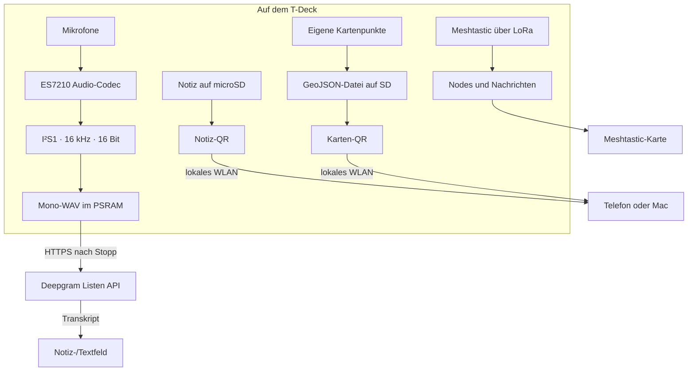

# Material für die Projektseite – LilyGO Cyberdeck

**Arbeitsstand:** 9. Oktober 2026 · Zieladresse: `mesh.d4sn3st.dev`

Dieses Dokument ist ein Inhaltsbaukasten für die spätere Projektseite. Die Formulierungen sind als Entwurf gedacht. Technische Aussagen zum nachgewiesenen Stand sind von noch nicht am Gerät geprüften Punkten getrennt.

## Kernidee

> **Ein T-Deck, das mehr kann als Nachrichten und Karten.**
>
> Das LilyGO T-Deck wird hier zu einem kleinen mobilen Cyberdeck: Meshtastic für das Mesh, Karten und eigene Markierungen für draußen, Notizen für unterwegs und Spracheingabe, wenn Tippen gerade nicht passt. Die Bedienung und die Werkzeuge entstehen direkt in der T-UI-Firmware.

### Kurztext

Das **LilyGO Cyberdeck** ist ein persönliches T-Deck-Projekt rund um Mesh-Kommunikation, Orientierung und mobiles Festhalten von Ideen. Es verbindet die vorhandene Meshtastic-Plattform mit einer erweiterten T-UI: Notizen, Agenten-/Terminalwerkzeuge, Kartenmarker und eine integrierte Spracheingabe. Eine Notiz oder die gesammelten Kartenpunkte lassen sich vor Ort per QR-Code auf ein MacBook oder Smartphone herunterladen.

### Mögliche Unterzeile

**Mesh. Karte. Notizen. Stimme.** Ein kleines Cyberdeck, das unterwegs Daten nicht nur anzeigt, sondern festhalten und wieder herausgeben kann.

## Warum das Projekt entstanden ist

Das T-Deck bringt Funk, Display, Tastatur, Trackball, Speicher, Mikrofone und Lautsprecher in ein tragbares Gerät. Die Standardoberfläche konzentriert sich vor allem auf Meshtastic. In diesem Projekt kam der Wunsch dazu, das Gerät auch wie einen mobilen Organizer zu verwenden: eine Notiz schnell festhalten, eine Stelle auf der Karte markieren, Informationen später wiederfinden und sie ohne Ausbau der SD-Karte auf den Mac übertragen.

Die T-UI ist in C++ und LVGL in die Firmware integriert. Deshalb ist eine neue Funktion nicht einfach eine zusätzliche App-Datei: sie muss in die bestehende Oberfläche, die Ereignisverarbeitung, die Speicherpfade und die begrenzten Ressourcen eines ESP32-S3 passen. Die Sprachaufnahme war dabei der aufwendigste Teil. Das Board braucht eine korrekte Initialisierung des ES7210-Codecs und einen passenden I²S-Aufnahmepfad. Ein hörbarer Lautsprecher-Ping allein konnte nicht beweisen, dass die Mikrofone Daten liefern.

## Was auf dem Cyberdeck steckt

### Mesh und Orientierung

- Meshtastic-Messaging und Node-/Positionsinformationen bleiben der Kern.
- Kartenansichten nutzen die verfügbaren Online- und Offline-Kartenpfade.
- Ein individueller violetter Raben-Pin markiert die eigene GPS-Position.
- Eigene T-UI-Kartenpunkte bekommen eine Feder als Symbol; Mesh-/Fremdpunkte behalten eine andere Darstellung.
- Kartenpunkte lassen sich als GeoJSON exportieren, damit sie am Mac in Karten- oder GIS-Werkzeugen weiterverarbeitet werden können.

### Notizen und Texte

- Notizen werden auf der microSD abgelegt.
- Im Editor helfen Auswahlaktionen für Kopieren, Ausschneiden, Einfügen und Löschen.
- Spracheingabe kann in Notes und weiteren Textoberflächen eingeblendet werden.
- Nach Ende der Aufnahme wird das Transkript an der aktuellen Cursorposition eingefügt.

### Spracheingabe

Die zwei Onboard-Mikrofone laufen über den ES7210. Die Firmware konfiguriert beide Eingänge über I²C, liest links und rechts als 16-Bit-Kanäle mit 16 kHz über I²S1 und wählt automatisch den stärkeren Eingang je Datenblock (MIC1 oder MIC2 kann auch fest gewählt werden). Daraus entsteht ein Mono-WAV im PSRAM. Nach dem Stopp schickt das T-Deck die Datei über HTTPS an Deepgram `/v1/listen`; die Antwort wird an der Cursorposition in das zuvor fokussierte Texteingabefeld eingesetzt. Eine Restzeitanzeige begleitet den maximal 30 Sekunden langen Take; wenn nicht genug zusammenhängender PSRAM verfügbar ist, ist die Aufnahme kürzer.

Die Aufnahme ist lokal im Arbeitsspeicher, die Erkennung selbst ist ein Online-Dienst. Für die Funktion braucht das Gerät WLAN/Internet und einen eigenen Deepgram-Schlüssel in der getrennten SD-Kartendatei `/deepgram.txt`. Der Schlüssel wird zur Laufzeit gelesen und nicht in die Firmware eingebaut. Ollama hat eine separate Konfigurationsdatei `/ollama.txt` und einen anderen Zweck. Die Beispielkonfiguration auf der Website darf ausschließlich einen Platzhalter-Key enthalten.

### Direkter Datentransfer per QR

Am Ende eines Tages soll das Gerät nicht nur ein Bildschirmfoto liefern. Deshalb geben zwei QR-Aktionen echte Dateien frei:

1. Im Notizmenü **QR-Download** auswählen, um genau die aktuelle Notiz zu laden.
2. In Maps im Zahnradmenü **Kartenpunkte per QR exportieren** auswählen, um eine GeoJSON-Datei zu laden.

Das T-Deck und der Mac/das Telefon müssen sich im gleichen erreichbaren WLAN befinden. Der QR enthält einen lokalen Download-Link. Die Freigabe ist zeitlich an den geöffneten Dialog gebunden und endet mit **Fertig**. Damit muss für diese Downloads weder ein FTP-Client eingerichtet noch die Karte aus dem Gerät genommen werden.

## Technischer Datenfluss

## Was am 6. Oktober 2026 praktisch geprüft wurde

- Der `t-deck-tft`-Build lief durch und wurde auf das angeschlossene T-Deck geflasht.
- Die Notes-Ansicht wurde nach dem Neustart am Gerät geöffnet; das QR-Menü und der Scanbildschirm waren sichtbar.
- Der QR-Link einer Testnotiz wurde vom Mac dekodiert und direkt aufgerufen. Ergebnis: HTTP 200, 5 Byte Dateiinhalt.
- Der QR-Link für Kartenpunkte wurde ebenfalls aufgerufen. Ergebnis: HTTP 200, gültiges GeoJSON `FeatureCollection` mit 0 Punkten.
- Nach **Fertig** war der alte temporäre Link nicht mehr erreichbar.
- Der Rabenmarker war in der laufenden Kartenansicht sichtbar.
- Der Feder-Marker ist in den geflashten Bilddaten enthalten, wartet aber noch auf den sichtbaren Test mit einem tatsächlich angelegten eigenen Pin.
- Beim damaligen QR-Flash-Test am 6.10. wurde Spracheingabe nicht erneut aufgerufen. Inzwischen bestätigt der Nutzer, dass Transkription in Notes, Ollama-Agent und Terminal grundsätzlich funktioniert; siehe den aktuellen Faktenkasten. Das ist Nutzerbestätigung, keine unabhängige Codex-Messung.

Damit sind die QR-Downloads auf echter Hardware belegt. Der Kartenexport ist bis zum Erstellen des ersten eigenen Pins strukturell, aber noch nicht mit einem nicht-leeren GeoJSON geprüft.

## Hintergrundgeschichte: warum das Mikrofon Arbeit war

Der T-Deck-Lautsprecher erzeugte schon einen Ping, aber das sagte nichts darüber aus, ob die Mikrofone korrekt initialisiert waren. Die Diagnose musste deshalb Aufnahmepegel, beide Audiokanäle, den ES7210-Status, den I²S-Empfang und die Wiedergabe getrennt betrachten. Es gab außerdem wechselnde Zustände bei Folgetests und bei der microSD. Der finale Pfad übernimmt die ES7210-Initialisierung nach dem ersten Start, schließt den Aufnahme-I²S-Pfad nach dem Take und nutzt I²S1 für das Mikrofon, getrennt vom Lautsprecherpfad auf I²S0.

Der Knackpunkt war die Zuordnung: **Deepgram transkribiert voraufgezeichnetes Audio; Ollama ist davon unabhängig.** Eine Mikrofontaste allein reicht nicht. Sie muss den Aufnahmezustand in der Textoberfläche starten/stoppen, das Audio korrekt schließen, den passenden API-Endpunkt mit der richtigen Authentifizierung nutzen und das Ergebnis ins fokussierte Feld einsetzen.

## Seitenstruktur, die sich anbietet

1. **Hero:** Gerätefoto, Name „LilyGO Cyberdeck“ und Unterzeile „Mesh. Karte. Notizen. Stimme.“
2. **Das Gerät:** T-Deck-Komponenten mit markierten Mikrofonen, Lautsprecher, Tastatur, Trackball, SD und LoRa.
3. **Die Oberfläche:** Screens aus Notes, Maps, Agent und Mic Test.
4. **Spracheingabe:** Ablaufdiagramm vom ES7210 bis zur Deepgram-Antwort; klar erklären, dass Netzwerk und API-Key gebraucht werden.
5. **Daten mitnehmen:** QR-Code für Notiz und GeoJSON-Export für Kartenpunkte.
6. **Karten und Symbole:** GPS-Rabe, Feder-Pin und Offline-Kartenpfade.
7. **Wie es gebaut wurde:** Iteratives Testen auf echter Hardware, mit klarer Trennung zwischen erfolgreichem Build und tatsächlich durchgeführtem Gerätetest.
8. **Downloads/Projektmaterial:** nur freigegebene Quellkopie, Bildassets und Dokumente; keine NVS-/Flash-Rohbackups oder API-Schlüssel.

## Faktenkasten für die Website

| Thema | Gesicherte Angabe |
|---|---|
| Gerät | LilyGO T-Deck, ESP32-S3 |
| Display | 320 × 240 ST7789 |
| Speicherhardware | 16 MB Flash, 8 MB PSRAM, microSD/TF |
| Funk | Meshtastic-LoRa über das vorhandene Boardmodul |
| Audioeingang | ES7210 und integriertes Mikrofonarray; beide Kanäle in der T-UI auswählbar/automatisch nutzbar |
| Aufnahme | 16 kHz, 16-bit, mono WAV; maximal 30 Sekunden pro Take im aktuellen Firmwarestand |
| Erkennung | Deepgram `/v1/listen`, online nach Aufnahmeende |
| Datenausgabe | temporärer HTTP-QR-Download für aktuelle Notiz oder Karten-GeoJSON |
| Quell-/Build-ID | aktiver Quellordner `source-current-2026-10-06`; App-Image `firmware-t-deck-tft-2.8.0.bin`, geflasht am 9. Oktober 2026 |
| Letzter Flash | 9. Oktober 2026, app-only bei `0x10000`; SHA-256 `77d4c02c39075a188dbf7dc476b4a7806bb46c59a58da90e3fff5ca5237714d2` |
| Spracheingabeprüfung | Nutzer bestätigt Transkription in Notes, Ollama-Agent und Terminal; Codex hat diese Apps nach dem 9.-Oktober-Flash nicht unabhängig einzeln getestet |

## Nicht für öffentliche Seiten übernehmen

- API-Schlüssel, `/deepgram.txt`, `/ollama.txt` oder WLAN-Zugangsdaten.
- Rohes komplettes Flash-Image oder NVS-Backups. Sie können Geräteeinstellungen und Zugangsdaten enthalten.
- Private Karten-/Notizdaten, genaue Aufenthaltsorte, WLAN-QR-Codes oder noch gültige Download-Tokens.
- Aussagen wie „vollständig offline“, „beliebig lange Aufnahme“, „alle Karten exportiert“ oder „jeder Gerätepfad geprüft“: Sie treffen auf den dokumentierten Stand nicht zu.
- Nicht als Codex-eigene Abnahme darstellen: Der aktuelle Cross-App-Status ist vom Nutzer bestätigt, nicht von Codex nach dem letzten Flash unabhängig einzeln geprüft.

## Referenzen

- [LilyGO T-Deck Dokumentation und Hardwaredaten](https://wiki.lilygo.cc/products/t-deck-series/t-deck/)
- [LilyGO T-Deck UnitTest: ES7210 und Mikrofone](https://github.com/Xinyuan-LilyGO/T-Deck/blob/master/examples/UnitTest/UnitTest.ino)
- [Deepgram: Pre-Recorded Speech-to-Text API](https://developers.deepgram.com/reference/speech-to-text/listen-pre-recorded?explorer=true)
- [Deepgram: Audio-Encoding-Hinweise](https://developers.deepgram.com/docs/encoding/)
